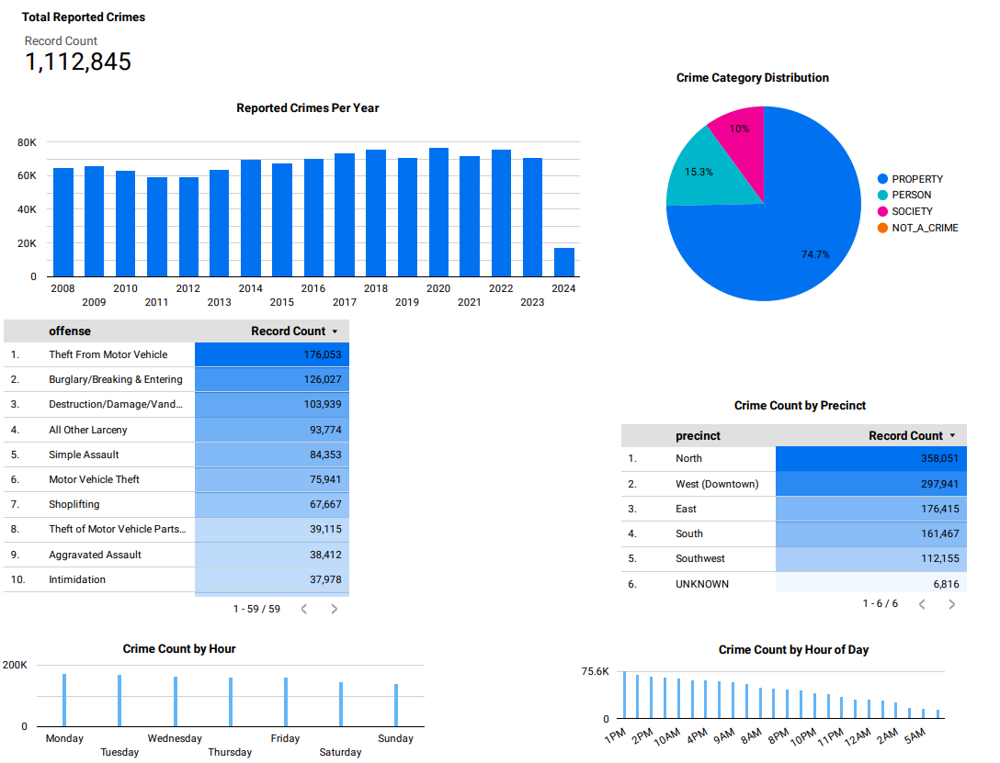
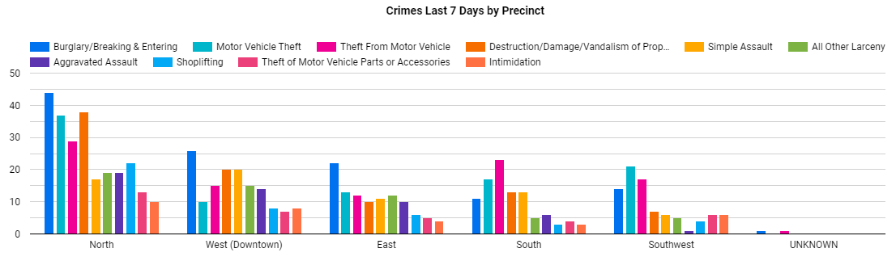
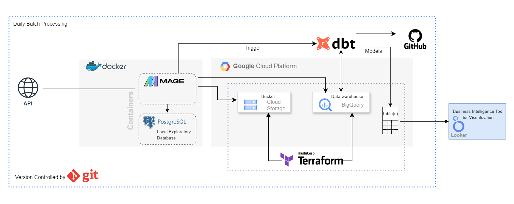

# Seattle Crime Data Pipeline: From Raw Data to Insights (2008 - present)


## Table of Contents
- [Seattle Crime Data Pipeline: From Raw Data to Insights (2008 - present)](#seattle-crime-data-pipeline-from-raw-data-to-insights-2008---present)
  - [Table of Contents](#table-of-contents)
  - [Project Description](#project-description)
    - [Questions Addressed:](#questions-addressed)
  - [Dataset](#dataset)
  - [Findings and Dashboard](#findings-and-dashboard)
    - [Seattle Crime Data Analysis](#seattle-crime-data-analysis)
    - [A Focus on Seattle Crime Data Over Last 7 Days From Latest Run](#a-focus-on-seattle-crime-data-over-last-7-days-from-latest-run)
    - [Some Recommendations](#some-recommendations)
  - [Technology and Tools](#technology-and-tools)
  - [Pipeline Overview](#pipeline-overview)
  - [Project Reproducibility](#project-reproducibility)
    - [Prerequisites:](#prerequisites)
    - [Steps:](#steps)
  - [Resource Clean Up](#resource-clean-up)
  - [Future Enhancements](#future-enhancements)

## Project Description
In this project, we aim to build a robust data pipeline that takes Seattle crime data from the years 2008 to 2024, processes it, and makes it available for analysis and visualization. The project encapsulates best practices in data engineering, including the use of containerization, infrastructure as code, and workflow orchestration.

### Questions Addressed:
- What are the common trends in crime incidents over the years?
- How do crime rates vary by location and time?
- What can we predict about future crime rates based on historical data?

## Dataset
The dataset contains detailed records of crime data from the Seattle Police Department, spanning from 2008 to the present. It offers a granular view of crime incidents, covering a variety of offenses, locations, and times.

Key attributes of the dataset include:
- `report_number`: A unique identifier for the crime report.
- `offense_id`: A distinctive code for each offense.
- `offense_start_datetime` and `offense_end_datetime`: Indicating when the crime was believed to have occurred.
- `report_datetime`: When the crime was reported to law enforcement.
- `group_a_b`: Classifying the offense as part of Group A or B crimes.
- `crime_against_category`: Denoting whether the crime was against an individual, property, or society.
- `offense_parent_group`: A broader category for the type of offense.
- `offense`: Description of the offense.
- `offense_code`: A code that classifies the offense.
- Geographic identifiers like `precinct`, `sector`, `beat`, and `mcpp` provide precise locations for where the incidents took place.
- `longitude` and `latitude`: Geolocational data for mapping the incident.

This dataset is utilized for the analytics pipeline in this project to uncover insights and hopefully inform decision-making related to crime. The dataset also facilitates transparency and community engagement by making the information accessible and actionable.

For more detailed information and to explore the dataset further, please visit the official [Seattle Police Department Crime Data](https://data.seattle.gov/Public-Safety/SPD-Crime-Data-2008-Present/tazs-3rd5/about_data) page.


## Findings and Dashboard
The insights derived from the data are visualized in a dashboard that provides an interactive interface for stakeholders to explore the crime data. The dashboard highlights key metrics and allows users to filter data based on different criteria such as year, crime type, and Seattle precinct.



### Seattle Crime Data Analysis

This analysis leverages data from over 1 million reported crimes in Seattle, yielding the following insights:

- **Theft Incidents**: Theft from motor vehicles is the most reported offense, tallying 176,053 incidents, suggesting a significant issue with vehicle-related property crimes.
- **Property Crime**: A staggering 74.7% of crimes fall under property-related offenses, with "All Other Larceny" and "Burglary/Breaking & Entering" accounting for 93,774 and 126,027 incidents, respectively.
- **Assault Reports**: Notably, simple and aggravated assaults together account for over 122,000 reports, indicating prevalent violent crime.
- **Precinct Disparities**: The North precinct reports the highest crime numbers at 358,051 incidents, followed closely by the West (Downtown) precinct with 297,941 incidents.
- **Hourly Crime Peaks**: Afternoon hours, particularly around 1 PM and 2 PM, show the highest crime activity, suggesting a need for increased vigilance during these times.
- **Day of the Week Variation**: Crime reports are fairly consistent across the week, with a slight uptick during weekends, emphasizing the need for constant readiness.
- **Crime Category Distribution**: In the Crime Category Distribution, the "NOT_A_CRIME" label may raise questions. This category typically includes incidents that are initially reported as crimes but are later found to fall outside the scope of criminal activity, such as justifiable homicides, police actions deemed lawful, or cases that are reclassified upon further investigation.

### A Focus on Seattle Crime Data Over Last 7 Days From Latest Run

The bar chart offers a breakdown of criminal activities in Seattle by precinct over the last week. Notably, the North and West (Downtown) precincts exhibit the highest diversity and volume of crimes. In these areas, `Burglary/Breaking & Entering`, `Motor Vehicle Theft`, and `Theft From Motor Vehicle` are the most common offenses, suggesting a particular vulnerability to property-related crimes. Across all precincts, these three crime types consistently appear as the top concerns, underscoring the need for enhanced vehicle and property security measures in Seattle. The prevalence of `Aggravated Assault` and `Simple Assault` in the North precinct may also indicate a hotspot for violent crime, warranting focused policing and community intervention efforts. Conversely, the `UNKNOWN` category suggests data recording discrepancies or incidents with unestablished locations, which highlights an area for administrative improvement. 

### Some Recommendations

- Enhance vehicle security protocols due to high theft from motor vehicles.
- Given the significant portion of crime represented by theft and burglary, it's likely that future efforts in crime prevention will need to continue focusing on these areas.
- Bolster property crime prevention strategies to tackle the dominant crime category.
- Implement targeted patrols during peak hours to mitigate afternoon crime spikes.
- Allocate resources efficiently across precincts, with a focus on North and West precincts.
- Maintain steady law enforcement coverage throughout the week, considering the marginal increase on weekends.

## Technology and Tools
This project utilized the following:
- **Containerization:** [Docker](https://www.docker.com/)
- **Infrastructure as code (IaC):** [Terraform](https://www.terraform.io/)
- **Workflow orchestration:** [Mage](https://www.mage.ai/)
- **Data Lake:** [Google Cloud Storage (GCS)](https://cloud.google.com/storage/)
- **Data Warehouse:** [BigQuery](https://cloud.google.com/bigquery)
- **Data Transformation:** [dbt](https://www.getdbt.com/)
- **DataVisualization:** [Looker Studio](https://cloud.google.com/looker-studio?hl=en)
- **Dev Database:** [PostgreSQL](https://www.postgresql.org/)
- **Version Control:** [git](https://git-scm.com/)
- **Programming Language:** [Python](https://www.python.org/), [SQL](https://en.wikipedia.org/wiki/SQL)

## Pipeline Overview
The pipeline consists of several stages:
1. Data ingestion from source to local database (for exploratory analysis) and cloud data lake.
2. Data cleaning and transformation.
3. Data loading into the data warehouse.
4. Data analysis and visualization.
5. IaC for cloud resource management

Each stage is designed to be modular and reusable, facilitating easy maintenance and scalability of the pipeline.

**click image to view full-size**




## Project Reproducibility
To ensure the project can be reproduced:
- All code is stored in a version-controlled git repository.
- Detailed setup and installation instructions are provided.
- Environment variables and configurations are managed through `io_config.yaml`.

### Prerequisites:
- Docker installed for local setup.
- Google Cloud account for remote setup.
- Git for repository cloning

### Steps:
1. Clone the repository.
2. Set up environment variables.
3. Run the Docker containers.
4. ... (additional steps)

## Resource Clean Up
Here are instructions for cleaning up Terraform resources to avoid incurring unnecessary cloud costs. You will want to tear down infrastructure provisioned by Terraform and immediately remove data from GCS and BigQuery.

When it's time to clean up resources on Google Cloud Platform (GCP) and prevent additional charges, Terraform provides a straightforward method for resource destruction. The `terraform destroy` command is designed to remove infrastructure managed by Terraform. It's always good practice to double-check which resources are slated for removal before confirming the action to avoid unintended data loss or service interruption. 

Here's how you use it - before running the destroy command, ensure that you are in the correct Terraform working directory and that your Terraform state reflects the current infrastructure you intend to delete. Additionally, review the plan output carefully before confirming the destruction of resources. Finally type the following command at your prompt:

```sh
terraform destroy
```

## Future Enhancements
- Implement additional data sources to make correlations for broader insights.
- Fully host pipeline in the cloud. The mage docker container is the only remaining piece.
- Improve the dashboard with more interactive features and improve the visualizations.
- General respository clean up of unecessary files